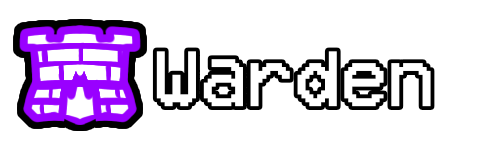

> [!NOTE]
> このリポジトリは[Town of Us Reactivated](https://github.com/eDonnes124/Town-Of-Us-R)の内容を書き直したもので、現在も開発中であるためバグが発生する可能性があります。
> このMODはモバイル版『Among Us』向けではなく、ホスト専用でもありません。移植や書き直しについてはお断りします。

-----------------------

  
  
Town Of Us Mira

  
    以下はTOU-Miraの公式サイトです。
  
  
  

 

「Town of Salem」をベースにした[Among Us](https://store.steampowered.com/app/945360/Among_Us)のMOD。「Town of Us Reactivated」の書き直し版として設計されています。

-----------------------

# TOU Miraとの主な相違点

- 刷新されたビジュアル
- 新役職（Ambassador, Ambusher, Inquisitor, Mirrorcaster）
- 新モデファイア（Scout, Telepath, Operative）
- 多言語対応（v1.1.1以降に実装予定）
- 基本役職サポート（MOD役職と基本役職の併用が可能）
- プレイヤーが使用可能なバランス調整要素を追加
- MiraAPI上で動作する他役職モッド各種との互換性

-----------------------

> [!TIP]
> 問題がある場合や一緒に遊ぶ仲間を探したい場合は、Reactivatedの公式[Discord](https://discord.gg/ugyc4EVUYZ)に参加してください！\
> 詳細については、TOU-Mira MODの公式[Wiki](https://au-avengers.github.io/docs.toum.gg)をご覧ください！

-----------------------

# コンテンツ

- [**コンテンツ**](#コンテンツ)
- [**リリース**](#リリース)
- [**変更内容-TOU Mira公式サイト**](https://au-avengers.github.io/docs.toum.gg/blog)
- [**インストール方法-TOU Mira公式サイト**](https://au-avengers.github.io/docs.toum.gg/docs/install/intro)
  - [Windowsの方 (Epic, Itch, MS Store, Steam)](https://au-avengers.github.io/docs.toum.gg/docs/category/windows-install)
  - [Linuxの方 (Epic, Itch, Steam)](https://au-avengers.github.io/docs.toum.gg/docs/category/linux--steam-deck-install)
- [**MOD情報-TOU Mira公式サイト**](https://au-avengers.github.io/docs.toum.gg/)
- [**クレジット & リソース-TOU Miraのwikiから**](https://github.com/AU-Avengers/TOU-Mira/wiki/Credits)
- [**ライセンス**](#ライセンス)
- [**著作権**](#著作権)

-----------------------

  
  
   
  
   
   
   
   
  
  
  
  
  
  
  
  
  
  
  
  
  
  
  
  
  
  
  
  
  
  
  
  
  
  
  
  
  
  
  
  
  
  
  
  
  
  
  
  
  
  
  
  
  
  
  
  
  
  
  
  
  
  
  
  
  
  
  
  
  
  
  
  
  
  
  
  
  
    
    
   
  
    
  
  
    
    
    
   

-----------------------

# リリース

**免責事項：このMODは、ゲームが更新された際に最新版のAmong Usで動作することを保証するものではありません。**

| Among Us   | MODリンク | ダウンロードリンク(TOU-Mira公式)                                             |
|------------|-------------|-------------------------------------------------------------------------|
| 2025.10.14 | 1.3.1       | [Download](https://github.com/AU-Avengers/TOU-Mira/releases/tag/v1.3.1) |
| 2025.9.9   | 1.3.0       | [Download](https://github.com/AU-Avengers/TOU-Mira/releases/tag/v1.3.0) |
| 2025.9.9   | 1.2.1       | [Download](https://github.com/AU-Avengers/TOU-Mira/releases/tag/v1.2.1) |
| 2025.9.9   | 1.2.0       | [Download](https://github.com/AU-Avengers/TOU-Mira/releases/tag/v1.2.0) |
| 2025.5.20  | 1.1.1       | [Download](https://github.com/AU-Avengers/TOU-Mira/releases/tag/v1.1.1) |
| 2025.5.20  | 1.1.0       | [Download](https://github.com/AU-Avengers/TOU-Mira/releases/tag/v1.1.0) |
| 2025.5.20  | 1.0.5       | [Download](https://github.com/AU-Avengers/TOU-Mira/releases/tag/v1.0.5) |
| 2025.5.20  | 1.0.2       | [Download](https://github.com/AU-Avengers/TOU-Mira/releases/tag/v1.0.2) |
| 2025.5.20  | 1.0.1       | [Download](https://github.com/AU-Avengers/TOU-Mira/releases/tag/v1.0.1) |
| 2025.5.20  | 1.0.0       | [Download](https://github.com/AU-Avengers/TOU-Mira/releases/tag/v1.0.0) |

旧バージョン

| Among Us   | Mod Version  | Download Link                                                                                                         |
|------------|--------------|-----------------------------------------------------------------------------------------------------------------------|

-----------------------

# ライセンス
このソフトウェアはGNU GPLv3ライセンスの下で配布されます。BepInExはLGPL-2.1ライセンスの下で配布されます。

# 著作権

このMODは『Among Us』またはInnersloth LLCとは一切関係がなく、本MODに含まれるコンテンツはInnersloth LLCによって承認または後援されていません。本MODに含まれる素材の一部はInnersloth LLCの所有されています。

© Innersloth LLC.

