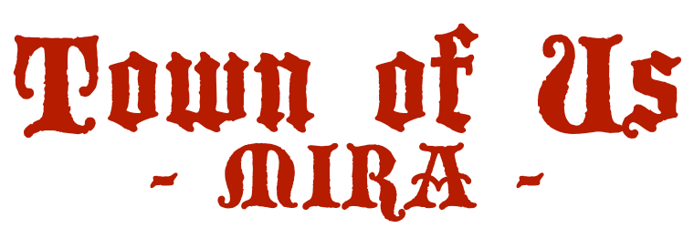
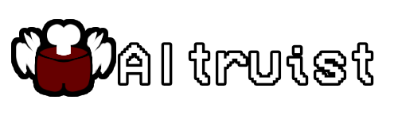
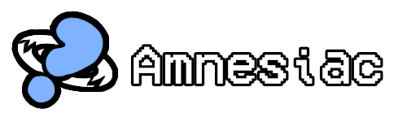

> [!NOTE]
> This repo is a fork of [Town of Us Reactivated](https://github.com/eDonnes124/Town-Of-Us-R) and is under constant development, expect bugs.\
> This mod is NOT for console versions of Among Us and is NOT host only either, please do not ask for a port or a rewrite.

-----------------------

Town Of Us Reactivated Rewritten!

 

An [Among Us](https://store.steampowered.com/app/945360/Among_Us) mod based on Town of Salem, designed to be a rewrite of Town of Us Reactivated!

> [!TIP]
> Join the Reactivated [Discord](https://discord.gg/ugyc4EVUYZ) if you have any problems or want to find people to play with!\
> Check out the mod's [wiki](https://github.com/AU-Avengers/TOU-Mira/wiki) for info!

-----------------------

# Contents

- [**Contents**](#contents)
- [**Releases**](#releases)
- [**Changelogs**](https://github.com/AU-Avengers/TOU-Mira/wiki/Changelog)
- [**Installation**](https://github.com/AU-Avengers/TOU-Mira/wiki/Installation)
  - [Requirements](https://github.com/AU-Avengers/TOU-Mira/wiki/Installation#requirements)
  - [Steam Guide](https://github.com/AU-Avengers/TOU-Mira/wiki/Installation#steam-guide)
  - [Epic Games Guide](https://github.com/AU-Avengers/TOU-Mira/wiki/Installation#epic-games-guide)
  - [Linux Guide](https://github.com/AU-Avengers/TOU-Mira/wiki/Installation#linux-guide)
  - [Results](https://github.com/AU-Avengers/TOU-Mira/wiki/Installation#results)
  - [Issues](https://github.com/AU-Avengers/TOU-Mira/wiki/Installation#issues)
  - [Uninstallation](https://github.com/AU-Avengers/TOU-Mira/wiki/Installation#uninstallation)
- [**Custom Game Settings**](https://github.com/AU-Avengers/TOU-Mira/wiki/Settings)
  - [Custom Client Side Options](https://github.com/AU-Avengers/TOU-Mira/wiki/Settings#custom-client-side-options)
- [**Mod Info**](https://github.com/AU-Avengers/TOU-Mira/wiki/Mod-Info)
- [**Credits & Resources**](https://github.com/AU-Avengers/TOU-Mira/wiki/Credits)
- [**License**](#license)
- [**Copyright**](#copyright)

-----------------------

  
    
  
  
  
  
  
  
  
  
  
  
  
  
  

-----------------------

# Releases

**Disclaimer: The mod is *not* guaranteed to work on the latest versions of Among Us when the game updates.**

| Among Us   | Mod Version | Download Link                                                                                   |
|------------|-------------|-------------------------------------------------------------------------------------------------|
| 2025.5.20  | 1.0.0       | [Download](TBD) |

Older Versions

| Among Us   | Mod Version  | Download Link                                                                                                         |
|------------|--------------|-----------------------------------------------------------------------------------------------------------------------|

-----------------------

# License
This software is distributed under the GNU GPLv3 License. BepInEx is distributed under the LGPL-2.1 License.

# Copyright

This mod is not affiliated with Among Us or Innersloth LLC, and the content contained therein is not endorsed or otherwise sponsored by Innersloth LLC. Portions of the materials contained herein are property of Innersloth LLC.

© Innersloth LLC.
